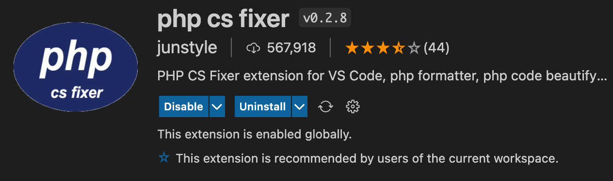
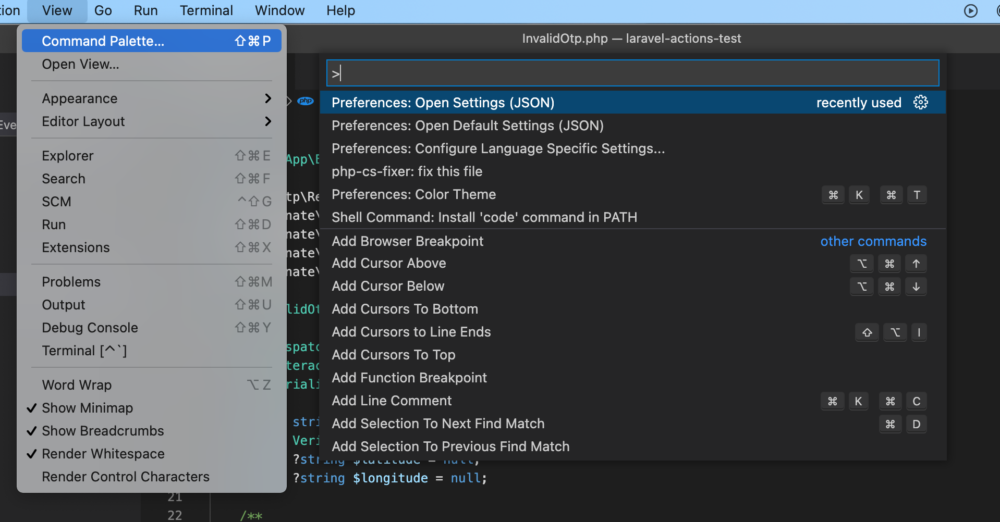

# GoApptiv Coding Style

- [PHP Coding Style](#ga-cs)
- [Auto Fix Laravel Project](#auto-fix-laravel-project)
- [Auto Format File on Save](#auto-format-file)
- [Setup GitHub Action](#github-action)

## PHP Coding Style

<a name="ga-cs"></a>
GoApptiv PHP Projects follows the [PSR-12](https://www.php-fig.org/psr/psr-12/) coding standard and the [PSR-4](https://www.php-fig.org/psr/psr-4/) autoloading standard.

<a name="auto-fix-laravel-project"></a>

## Auto Fix Laravel Project

This process will automatically fix all the files in the project to the GoApptiv Coding style format.

### Step 1:

```bash
composer require friendsofphp/php-cs-fixer --dev
```

### Step 2:

In your project root, create a new file named .php-cs-fixer.php and add the following code and then save it.

```php
<?php

use PhpCsFixer\Config;
use PhpCsFixer\Finder;

$finder = Finder::create()
    ->in([
        __DIR__ . '/app',
        __DIR__ . '/config',
        __DIR__ . '/database',
        __DIR__ . '/resources',
        __DIR__ . '/routes',
        __DIR__ . '/tests',
    ])
    ->name('*.php')
    ->notName('*.blade.php')
    ->ignoreDotFiles(true)
    ->ignoreVCS(true);

$config = new PhpCsFixer\Config();

return $config->setRules([
        '@PSR12' => true,
        'array_syntax' => ['syntax' => 'short'],
    ])
    ->setFinder($finder)
;
```

This file contains local configurations that will be used instead of project configurations. It will let you configure rules, the files, and the directories that need to be analyzed.

### Step 3:

Open `composer.json` file and add the following lines to the script section:

```json
"sniff":[
   "./vendor/bin/php-cs-fixer fix -vvv --dry-run --show-progress=dots"
],
"lint":[
   "./vendor/bin/php-cs-fixer fix -vvv --show-progress=dots"
]
```

### Step 4:

Run `composer lint` in the project to auto fix all the existing files.

<a name="auto-format-file"></a>

## Auto Format File on Save

Remembering and following all the rules can be difficult, You can implement auto file format in VS Code using the following configurations.

### Step 1:

Install PHP cs fixer from the VS Code Extensions.



### Step 2:

Open Command Palette and Select Open Settings (JSON)



### Step 3:

Add the following code in the settings at the end of the file

```
 "php-cs-fixer.executablePath": "${extensionPath}/php-cs-fixer.phar",
 "php-cs-fixer.onsave": true,
 "php-cs-fixer.config": ".php-cs-fixer.php;.php-cs-fixer.dist.php;.php_cs;.php_cs.dist",
```

<a name="github-action"></a>

## Setup GitHub Action

Add the following lint.yml file in the GitHub workflows to setup PHP CS Check

Note: Make sure `.php-cs-fixer.php` is present in the root project and run the rules check

```
on: [push, pull_request]
name: Check Standards
jobs:
 php-cs-fixer:
   name: GoApptiv-CS-Checker
   runs-on: ubuntu-latest
   steps:
     - uses: actions/checkout@v2
     - name: PHP-CS-Fixer
       uses: docker://oskarstark/php-cs-fixer-ga
       with:
         args: --config=.php-cs-fixer.php --diff --dry-run
```
