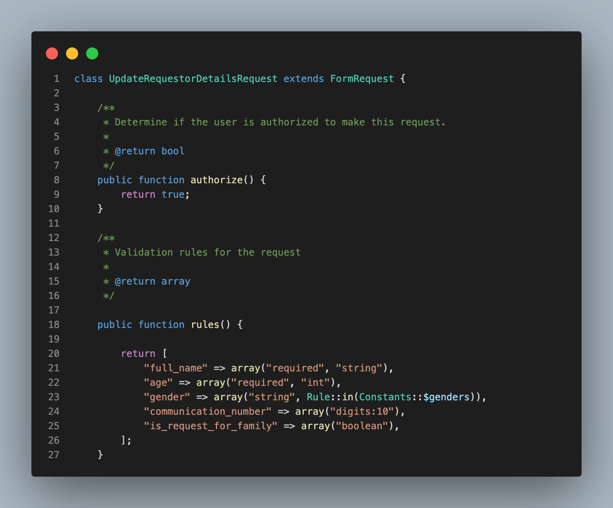
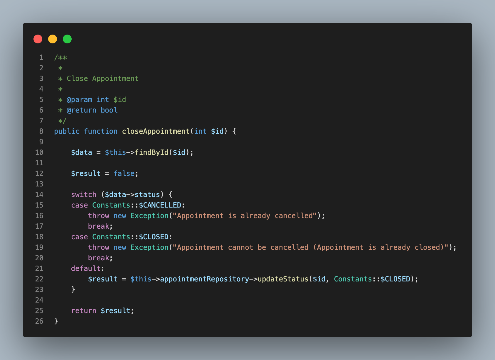
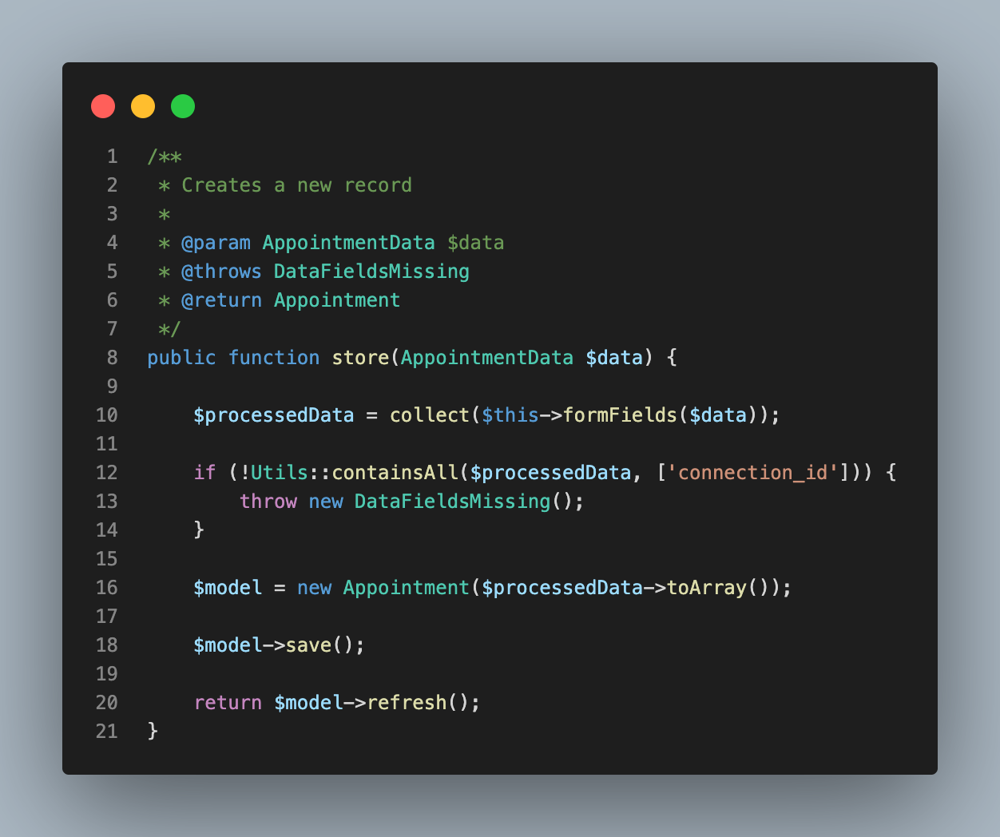
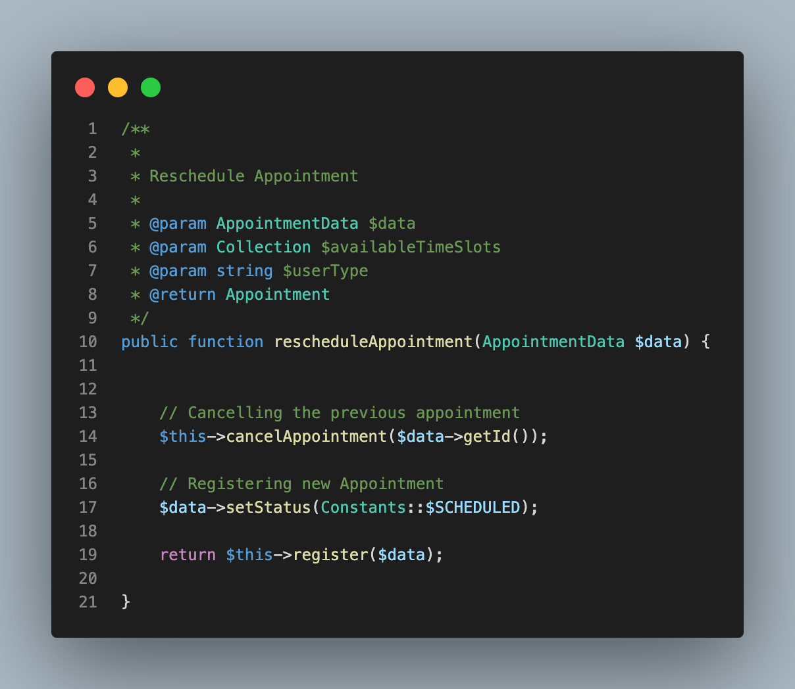

# GoApptiv PHP Laravel Standards

- [Naming Conventions](#naming-conventions)
  - [Do's and Don'ts](#naming-conventions-dos-donts)
- [Functionality](#functionality)
  - [Validations](#functionality-validations)
  - [Business Logic](#functionality-business-logic)
  - [Repository](#functionality-repository)
  - [Pure Functions](#functionality-pure-functions)

<a name="naming-conventions"></a>

## Naming Conventions

Use proper and meaningful names of functions and variables. Follow a standard format of variables and functions name across the project.

<a name="naming-conventions-dos-donts"></a>

### Naming conventions Do’s and Don'ts

<table>
  <tr>
    <td>What</td>
    <td>How</td>
    <td>Good </td>
    <td>Bad</td>
  </tr>
  <tr>
    <td>Controller</td>
    <td>Singular</td>
    <td>AppointmentApiController</td>
    <td>AppointmentsApiController</td>
  </tr>
  <tr>
    <td>Model</td>
    <td>Singular</td>
    <td>Appointment</td>
    <td>Appointments</td>
  </tr>
  <tr>
    <td>Tables</td>
    <td>Plural</td>
    <td>appointments</td>
    <td>appointment</td>
  </tr>
  <tr>
    <td>Table names</td>
    <td>Use snake_case</td>
    <td>connection_requests</td>
    <td>connectionRequest</td>
  </tr>
  <tr>
    <td>Table Column</td>
    <td>Use snake_case</td>
    <td>connection_id</td>
    <td>connectionId</td>
  </tr>
  <tr>
    <td>Method</td>
    <td>camelCase</td>
    <td>getAppointments()</td>
    <td>get_appointments()</td>
  </tr>
  <tr>
    <td>Variable</td>
    <td>camelCase</td>
    <td>connectionRequest</td>
    <td>connection_request</td>
  </tr>
</table>

<a name="functionality"></a>

## Functionality

<a name="functionality-validations"></a>

### Validations

Add validations in request class instead of controller and service

```bash
php artisan make:request UpdateRequestorDetailsRequest
```



<a name="functionality-business-logic"></a>

### Business Logic

Add all the business logic in the service class.



<a name="functionality-repository"></a>

### Repository

Add all Database related queries in the Repository class, avoid using the Queries in Controller, Service and Jobs.

### 

<a name="functionality-pure-functions"></a>

### Create Pure and reusable functions

Creating functions that are reusable are pure in nature, The function should accept the input and provide an output based on the input and should not vary the result based on external variables.

The cancel appointment and register functions were reused in the rescheduleAppointment function.


